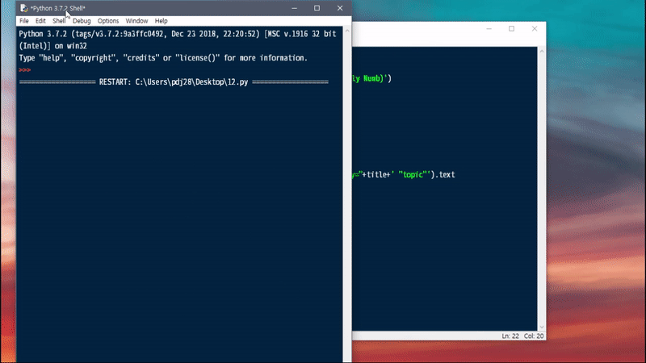

# yt_getaudio

자동으로 유튜브 topic 생성영상의 음원을 추출하는 파이썬 스크립트

## 사용 방법
1. pip 등을 통해 `requests`, `youtube-dl`, `pafy` 순으로 패키지를 설치합니다
2. 해당 스크립트를 실행하고 원하는 곡의 아티스트와 곡명을 입력합니다.
3. 엔터를 치고 좀 기다린 뒤 나오는 링크를 복사합니다.
4. 브라우저 혹은 wget 등을 이용해 음원을 다운받습니다.

## 참고 사항
- topic 키워드와 함께 나오는 결과에서 가장 첫번째 영상을 다운받는 방식입니다. 그렇기 때문에 대부분은 제대로 자동 음원이 선택되지만 가끔 다른 영상이 선택될 수 있으니 유의 바랍니다.
- 음원은 pafy 기준 best audio 로 받아집니다. (대개 opus 160kbps)
- 출력되는 URL은 영구적이지 않습니다. 가능한 얼른 받으시기 바랍니다.
- 만약 코드가 제대로 실행이 안된다면 맨 윗줄에 `import youtube_dl`을 추가한 뒤 다시 시도해 보세요.
